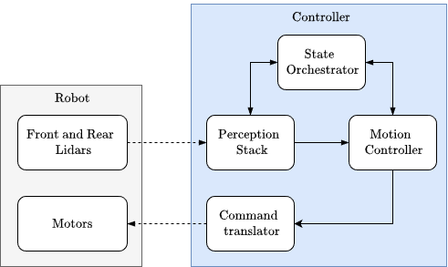
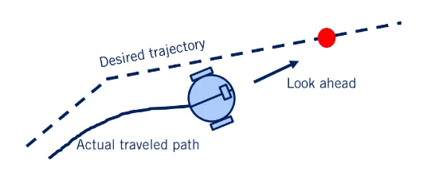

# Airlab Field Robot Event
This repository contains the description, architecture, tests and results for Task 1 of the Field Robot Event 2025 as part of the AirLAB team of Politecnico di Milano. The 2025 competition edition was held in Milan from June 9 to 12.

## Task 1 Description
The objective of the task was to develop an autonomous navigation algorithm to enable our mobile robot to navigate within a crop field, includidng in-row navigation, as well as the change-of-row feature.

The following image depicts a precise sketch of the actual competition field.

  

Each robot should start its motion from the "START" position. The crop field has dimension of, approximately, $10\,\mathrm{m} \times 20\,\mathrm{m}$. Each row is spaced $0.75\, \mathrm{m}$ from each other, and the height of the maize plants was expected to be $0.3\, \mathrm{m} - 0.4\, \mathrm{m}$.

The robot was expected to navigate within the field following an structured sequence of actions, given on the same day of the competition. From the picture, for example, we can interpret the following action commands:

- 1L : Turn left and move to the next adjacent row.
- 1R : Turn right and move to the next adjacent row.
- 2L : Skip one row and enter the second row to the left.

Example of command sequence:
- 1L , 1R , 2L , 3L , 1L

### Scoring
The scoring for each participant robot is given by the following formula:

$P_{task1}=P_{distance}-P_{penalty}+P_{bonus}(t)$

$P_{task1}$ stands for the overall score, that includes the covered distance ($P_{distance}$), the penalty given by damaging plants ($P_{penalty}$) and a time-dependent bonus if the task is finished before the 3-minutes threshold ($P_{bonus}$).

More detailed information regarding task 1 and the overall competition can be found in [1].

## Solution Considerations

The following section contains an overview of the literature and references that were found to define our methodology for the solution, as well as a brief description of the robot constraints, including the sensor setup available.

### Literature and Methodology

An initial idea of the solution was reached by considering previous work, such as [2]. Besides, a repo containing a baseline for Task 1 solution was provided by AIRLab.

Moreover, topic-related courses offered by Politecnico di Milano, such as "Robotics", and "Automation and Control of Autonomous Vehicles" were very useful for obtaining the foundations to further develop our solution.

Based on the above mentioned, we adopted a solution that follows a modular approach, in which each main feature is corresponds to a particular node, enabling an easy maintenance of the code and the implementation of the Finite State Machine (FSM), which is the main architecture of our solution and will be explained later. 

### Robot Constraints

The robot has 3 operating modes: "AUTONOMOUS" , "MANUAL" and "STILL".
The Autonomous mode is the one used for the competition, which should enabled the robot to autonomously navigate within the field. Manuel mode enables the teleoperation of the robot using the Joystick. And Still mode just keeps the robot standing without moving.

The robot was able to move in one of the supported motions: Ackermann, Crab or Pivot.

As sensor setup we were provided two 2D-LiDARs in the front and the rear of the robot, so we have a 360° view availability for detecting the robot surroundings.

## Environment

The whole project was developed and tested on the following environment:

| Component | Version |
|-----------|---------|
| OS | Ubuntu 22.04 LTS |
| ROS 2 | Humble |
| Docker | ✓ |
| Python | 3.10.12 |

### Dependencies

#### ROS 2 Packages
Main packages used:
- `tf2_ros` → coordinate frames transformations 
- `rviz2` → sensor data visualization
- `robot_state_publisher` → publishes the URDF of the robot
- `pcl_ros` → Pointcloud processing

## Software Architecture

A high-level diagram, for the sake of privacy, is shown in the following image.

  

## Architecture Description

From the robot side we have the following blocks:
* Front and rear lidars: These are the only sensor available for our solution.
* Motors: We have 8 motors for the robot motion: 4 drive motors and 4 steering motors.

On the other hand, from the Controller side we have:
* Perception Stack: Module that handles the sensor data and generates the path to be followed.
* Motion Controller: Module that, given a path and current state of the robot, compute the robot action.
* State Orchestrator: Module that contains the Finite State Machine and communicates with the "Perception Stack" and the "Motion Controller" module.
* Command translator: Transform the motion computed from the controller in wheel speeds and positions.

In general, the solution implemented includes the notion of pure pursuit applied to robotics. The image depicts an idea of the navigation approach [3]. As parameters for our solution the width of the crop row, as well as the look ahead distance were defined.

  

## Simulation tests

## On-site tests

## Acknowledgements

I would like to aknowledge the work of the AIRLab team, specially with whom I worked on the development of our algorithm for task 1:
* [Alessio Spinetto](https://github.com/Comodaino)
* [Filippo di Fiore](https://github.com/Dif912)

Besides, a special thanks to AIRLab for the support and giving us the opportunity to gain hands-on experience in robotics.

## References
[1] [Field Robot Event 1](https://onecdn.io/media/fre2025rulesv10-526fd5a3-2ff8-4ae4-b1d4-b6f9f77f45ef.pdf) \
[2] R. Bertoglio, V. Carni, S. Arrigoni and Matteo Matteucci,
"A Map-Free LiDAR-Based System for Autonomous Navigation in Vineyards",
[arXiv](https://arxiv.org/abs/2307.03080) \
[3] [Pure Pursuit in ROS](https://medium.com/@jefffer705/pure-pursuit-in-ros-noetic-7b2c0a3c36ef)
