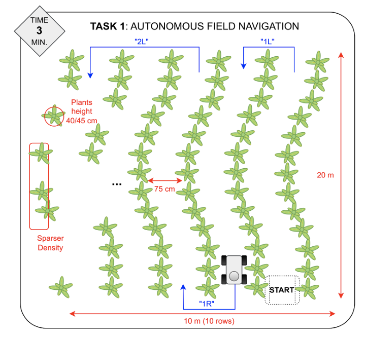

# Airlab Field Robot Event
This repository contains the description, architecture, tests and results for Task 1 of the Field Robot Event 2025 as part of the AirLAB team of Politecnico di Milano. The 2025 competition edition was held in Milan from June 9 to 12.

## Task 1 Description
The objective of the task was to develop an autonomous navigation algorithm to enable our mobile robot to navigate within a crop field, includidng in-row navigation, as well as the change-of-row feature.

The following image depicts a precise sketch of the actual competition field.

  

Each robot should start its motion from the "START" position. The crop field has dimension of, approximately, $10\,\mathrm{m} \times 20\,\mathrm{m}$. Each row is spaced $0.75\, \mathrm{m}$ from each other, and the height of the maize plants was expected to be $0.3\, \mathrm{m} - 0.4\, \mathrm{m}$.

The robot was expected to navigate within the field following an structured sequence of actions, given on the same day of the competition. From the picture, for example, we can interpret the following action commands:

- 1L : Turn left and move to the next adjacent row.
- 1R : Turn right and move to the next adjacent row.
- 2L : Skip one row and enter the second row to the left.

Example of command sequence:
- 1L , 1R , 2L , 3L , 1L

### Scoring
The scoring for each participant robot is given by the following formula:

$P_{task1}=P_{distance}-P_{penalty}+P_{bonus}(t)$

$P_{task1}$ stands for the overall score, that includes the covered distance ($P_{distance}$), the penalty given by damaging plants ($P_{penalty}$) and a time-dependent bonus if the task is finished before the 3-minutes threshold ($P_{bonus}$).

More detailed information regarding task 1 and the overall competition can be found in [1].

## Solution Architecture

As were mentioned in the rules, a Global Navigation Satellite System (GNSS) sensor cannot be used. For this reason, we adopted a LiDAR-based approach for our algorithm. The i

## Simulation results

## On-site tests

## Results

## Aknowledgements

I would like to aknowledge the work of my team, specially with whom I worked on the development of our algorithm for task 1.
-
-
Besides, a special thanks to AirLAB for the support and giving us the opportunity to gain hands-on experience in robotics.

## References
[1] [Field Robot Event 1](https://onecdn.io/media/fre2025rulesv10-526fd5a3-2ff8-4ae4-b1d4-b6f9f77f45ef.pdf)
